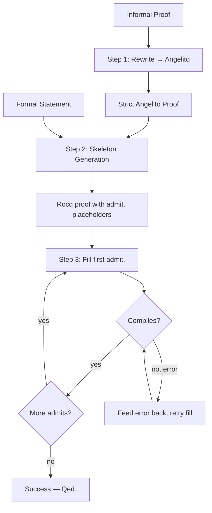

# Proof Pipeline Architecture

This document describes the Rocq/Coq proof pipeline. The pipeline takes an informal proof, rewrites it into strict Angelito syntax, generates a Rocq skeleton with `admit.` placeholders, then iteratively fills each placeholder and compiles.

## High-Level Flow

## Data Flow

1. **Input** — An informal mathematical proof and a formal theorem statement (`.v` file).
2. **Rewrite** — Turn the informal proof into strict Angelito syntax (`PROVE`, `ASSUME`, `FACT`, `SIMPLIFY`, `THEREFORE`, `CONCLUDE`, etc.) using the Angelito spec.
3. **Skeleton** — Translate the Angelito proof's outer structure into Rocq: `induction`, `apply`, `intros`, etc. with `admit.` for every leaf goal. The skeleton compiles with `Admitted.`.
4. **Iterative fill** — For each `admit.` (first to last):
   - Mark it with `(* FILL THIS *)`
   - Ask the model to produce replacement tactics using the Angelito proof as guidance and the tactics reference
   - Write the replacement, compile with `coqc`
   - If compilation fails, parse the error and retry (up to `max_fill_attempts`)
5. **Final check** — Once all admits are filled, write `Qed.` and do a final `coqc` compile.

## Angelito → Rocq Translation

The pipeline uses `angelito-to-rocq.md` as the translation spec. Key mappings:

| Angelito | Rocq |
|----------|------|
| `ASSUME x : T` | `intros x.` |
| `INDUCTION n` | `induction n.` |
| `APPLY thm SPLIT INTO` | `apply thm.` + bullets |
| `SIMPLIFY RHS expr [BY l]` | `simplify rhs expr using ltac:(rewrite l).` |
| `FACT h: stmt [BY lemma]` | `assert (h : stmt). { apply lemma. }` |
| `THEREFORE concl` | `exact ...` |

## Custom Tactics

Target `.v` files should include `From Angelito Require Import Tactics.` to load custom tactics like `assume`, `simplify lhs/rhs`. See `prompts/tactics_reference.md` for the full list.

## Automated Pipeline

See [pipeline/README.md](../pipeline/README.md) for setup and usage.
