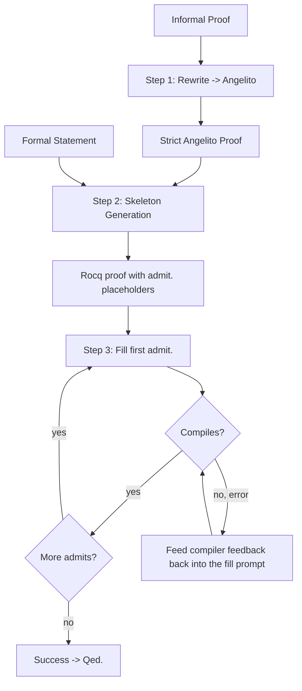

# Proof Pipeline Architecture

This document describes the current Rocq proof pipeline. The pipeline takes an informal proof, rewrites it into strict Angelito syntax, generates a Rocq skeleton with `admit.` placeholders, then iteratively fills each placeholder and recompiles.

## High-Level Flow



## Data Flow

1. **Input** -> An informal mathematical proof and a formal theorem statement (`.v` file).
2. **Rewrite** -> Turn the informal proof into strict Angelito syntax (`PROVE`, `ASSUME`, `FACT`, `SIMPLIFY`, `THEREFORE`, `CONCLUDE`, etc.). Angelito keywords are declarative proof-language markers, not Rocq tactics.
3. **Skeleton** -> Translate only the outer Angelito structure into Rocq: `induction`, `apply`, `intros`, bullets, and `admit.` leaves.
4. **Iterative fill** -> For each `admit.` slot:
   - Mark it with `(* FILL THIS *)`
   - Probe the focused goal state
   - Ask the model for tactics for that slot only
   - Splice the tactic block into the skeleton programmatically
   - Compile with `coqc`
   - If compilation fails, retry with structured compiler feedback when available
5. **Final check** -> Once all admits are filled, write `Qed.` and do a final `coqc` compile.

## Angelito -> Rocq Translation

The pipeline uses [angelito-to-rocq.md](../angelito-to-rocq.md) as the translation guide. Key mappings:

| Angelito | Rocq |
|----------|------|
| `ASSUME x : T` | `pick x : T.` or `intros x.` depending on whether a typed introduction is needed |
| `GOAL: expr` | `assert_goal (expr).` |
| `INDUCTION n` | `induction n.` |
| `APPLY thm SPLIT INTO` | `apply thm.` plus bullets or braces |
| `SIMPLIFY RHS a = b [BY proof]` | `simplify rhs (a = b) by proof.` or `simplify rhs (a = b). { proof. }` |
| `SIMPLIFY LHS a = b [BY proof]` | `simplify lhs (a = b) by proof.` or `simplify lhs (a = b). { proof. }` |
| `FACT h: stmt [BY lemma]` | `assert (h : stmt). { apply lemma. }` |
| `THEREFORE concl` | `assert`, `exact`, or a short tactic block, depending on context |

## Custom Tactics

Generated proof files under `coq/` should import:

```coq
From RocqCoSPOC Require Import Angelito.
Import Angelito.Ltac1.
```

That import pair enables the project-specific Ltac1 tactics such as `assert_goal`, `simplify lhs`, `simplify rhs`, and `pick`. Those tactics are defined in [coq/Angelito.v](../coq/Angelito.v).

## Automated Pipeline

See [pipeline/README.md](../pipeline/README.md) for setup and usage.
