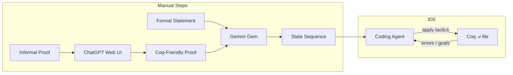

# CoSProver-for-Coq: Architecture (Experimental Manual Workflow)

This document describes the manual, experimental emulation of **CoSProver** ("Translating Informal Proofs into Formal Proofs Using a Chain of States") adapted for Coq/Rocq. No Python pipeline or Coq REPL driver is used; the workflow is manual and tool-based.

---

## 1. Paper vs Our Workflow

| Step | Paper (Lean) | Our experimental approach |
|------|--------------|----------------------------|
| 1. Rewrite | DeepSeek-R1 → Lean-friendly | **ChatGPT web UI** — paste informal proof, use prompt #1, copy Coq-friendly text |
| 2. Chain of States | Fine-tuned 7B + elaboration | **Gemini gem** — paste statement + Coq-friendly proof, get state chain (free tier) |
| 3. Tactics + verify | LLM + kernel | **IDE coding agent** — agent edits `.v` file, applies tactics; Coq/IDE gives errors → agent fixes (ETR/ESR in the loop) |

---

## 2. High-Level Flow



---

## 3. Data Flow

1. **Input:** An informal mathematical proof and (optionally) the Coq formal statement of the theorem.
2. **Step 1 — Rewrite:** You paste the informal proof into ChatGPT with prompt #1. You copy the model’s reply as the **Coq-friendly informal proof** (explicit induction/case/arithmetic, no “similarly”, etc.).
3. **Step 2 — Chain of States:** You open your **Gemini gem** (or a chat with the CoS prompt). You paste the **formal statement** and the **Coq-friendly proof**. Gemini returns a **chain of states** in Coq REPL format (`State 0:`, hyps, `============================`, goal, … `No Goals`). You copy this sequence.
4. **Step 3 — Tactics:** In your IDE, you have a Coq `.v` file with the theorem and a `Proof.` block. For each adjacent pair (S_current, S_next) in the chain, you ask the **coding agent** to apply tactics to go from S_current to S_next. The agent edits the proof script. You run Coq (or the IDE runs it). If Coq reports an error, you paste the error and failed tactics and use **prompt #4 (ETR)**. If the tactics succeed but the resulting state does not match the blueprint, you use **prompt #5 (ESR)** and paste State A, B, C.
5. **Verification:** Done by the Coq compiler and IDE; the agent sees goals and errors directly. No separate REPL or verifier script.

### Optional automation add-on

For a less manual loop, run:

```powershell
.\scripts\get-proof-state.ps1 -FilePath <path-to-file> -CursorLine <line>
```

That prints the current state block in CoS format, which can be pasted as `state_p` into prompt #3 (or #4/#5 when needed).

---

## 4. Coq State Format

Used by the Gemini gem and the IDE agent:

- **One state:** Hypotheses listed line-by-line as `name : type`, then a line `============================`, then the goal.
- **Separator between states:** Two newline characters.
- **Final state:** `No Goals`.
- **State labels:** `State 0:`, `State 1:`, etc.

Example:

```
State 0:
a : R
b : R
h : a <= b
============================
rexp(a) <= rexp(b)

State 1:
a : R
b : R
h : a <= b
============================
a <= b

State 2:
No Goals
```

---

## 5. Error Loops (Manual)

- **ETR (Error Tactic Regeneration):** When Coq reports a tactic/syntax error, paste the initial state, target state, failed tactics, and Coq error into prompt #4 and send to the IDE agent. The agent proposes corrected tactics.
- **ESR (Error State Renewal):** When the tactics run but the resulting state (State C) is not the intended state (State B), paste State A (start), State B (target), and State C (actual) into prompt #5 and send to the agent. The agent suggests a tactic sequence from A to B.

No automated loop: you decide when to invoke ETR or ESR and paste the relevant prompt.
